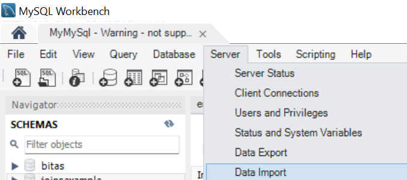
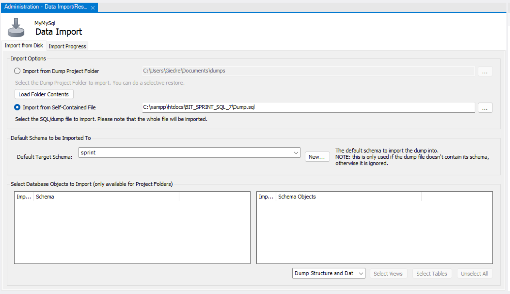

# BIT SPRINT PROJECT 7

### PROJECT MANAGEMENT SYSTEM 

This project was made for learning purposes.

### About project

* This project was created using PHP, CSS and Bootstrap. Database and tables with employees and projects information was made with MySQL Woekbench.

* In this Project Management System you can:
    - add projects and employees,
    - update projects and employees,
    - delete projects and employees,
    - assign project (from the projects list) to employee.
    All these changes will be updated in MySQL database.

### Installiation

1. To install this project you need to have GIT BASH, XAMPP and MySQL Workbench.

2. In XAMPP folder you need to navigate to folder `htdocs`.

3. Then you need to clone repository. Copy link of repository:

https://github.com/giedrebi/BIT_SPRINT_SQL_7.git

4. Open GIT BASH in `htdocs` folder.

5. Type `git clone`, then paste the URL you copied earlier and press Enter to create your local clone:

`$ git clone https://github.com/giedrebi/BIT_SPRINT_SQL_7.git` 

6. Open MySQL Workbench and create database named `sprint`.  

`CREATE DATABASE sprint;`

7. In top of MySQL Workbench choose `Server -> Data import`:

8. Then, in Data import tab, you need to do these steps:
    * section Import Options - select `Import from Self-Contained File`, and choose file from cloned repository Dump.sql,
    * section Default Schema to be Imported To - select `sprint` (the database you just created),
    * go to Import Progress and press `Start Import`.
    * reload schema, then database with new tables should be there.

9. Run XAMPP and start Apache and MySQL Web Server.

10. Open your browser and in the search bar type:

`localhost/BIT_SPRINT_SQL_7/`

### Author

This project was created by me [Giedre Bielske](https://giedrebi.github.io/)

As well, you can find me in [LinkedIn](https://www.linkedin.com/in/giedr%C4%97-bielsk%C4%97-1a8996107/)